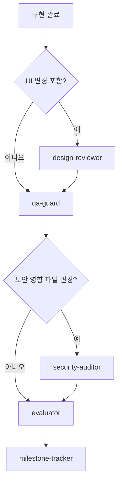

# 보안 에이전트 분리 설계 인계

## 세션 메타데이터

| 항목 | 값 |
|---|---|
| 작성일 | 2026-07-07 KST |
| 프로젝트 | `oms-codex` |
| Git 상태 | 초기 작성 당시 `.git` 디렉터리 없음 |
| 목적 | `qa-guard` 비대화 방지와 보안 검증 agent 분리 구현 상태를 이어받기 위한 인계 |

## 현재 상태 요약

현재 하네스에는 독립된 보안 전담 custom agent인 `security-auditor`가 추가되어 있다. 보안 검증은 빠른 정적 탐지와 심층 감사로 분리된다. `qa-guard`는 SQL injection, 하드코딩 자격증명, 응답 민감정보 노출 같은 빠른 정적 탐지와 품질 게이트를 담당하고, 권한 경계·IDOR·인증/인가 우회·세션·토큰·webhook·민감정보 공격면은 `security-auditor`가 담당한다.

운영 배포 준비도 항목은 바로 agent로 추가하지 않고, `release-readiness-auditor` 후보로 보류한다.

## 코드베이스 이해

### 주요 구조

| 경로 | 역할 | 이번 설계와의 관련성 |
|---|---|---|
| `.codex/agents/` | custom agent TOML 정의 | `security-auditor.toml` 추가됨 |
| `.agents/skills/` | agent가 사용하는 skill 정의 | `security-audit/SKILL.md` 추가됨 |
| `.agents/skills/qa/SKILL.md` | `qa-guard` 검증 절차 | 심층 보안 책임을 분리하고 빠른 정적 탐지 중심으로 조정됨 |
| `.agents/skills/orchestrate/SKILL.md` | 마일스톤 파이프라인 조율 | `security-auditor` 조건부 호출과 evaluator 이전 차단 규칙 추가됨 |
| `scripts/verify.ps1` | Windows 검증 스크립트 | agent 11개, skill 12개 기준 반영됨 |
| `scripts/verify.sh` | Bash 검증 스크립트 | agent 11개, skill 12개 기준 반영됨 |

### 현재 agent 목록

현재 `.codex/agents`에는 11개 agent가 있다.

- `bug-fixer`
- `compound-learner`
- `design-reviewer`
- `evaluator`
- `milestone-tracker`
- `plan-auditor`
- `qa-guard`
- `refactor-specialist`
- `security-auditor`
- `session-archivist`
- `tdd-agent`

## 결정 사항

| 결정 | 선택지 | 근거 |
|---|---|---|
| `qa-guard` 유지 범위 | 빠른 코드 품질 게이트 | 매 변경 단위로 실행되는 agent이므로 빠르고 반복 가능한 검증에 집중해야 한다 |
| 보안 전담 agent | `security-auditor` 1차 추가 | 권한·인증·민감정보 검토는 코드 품질보다 공격면 검토에 가깝다 |
| 운영 준비도 agent | 1차 범위에서 제외 | 백업·복구·로그·시간대·금액 정책은 중요하지만 보안 agent에 넣으면 다시 비대해진다 |
| Thread 7개 항목 반영 방식 | 보안/운영/데이터 무결성으로 분류 | 모든 항목을 보안 체크로 취급하면 책임 경계가 흐려진다 |

## 목표 역할 분리

| Agent | 목적 | 실행 시점 | 산출물 |
|---|---|---|---|
| `qa-guard` | 변경 코드의 기술 품질 게이트 | 구현 직후, 매 변경 단위 | `_workspace/qa_{feature}_{datetime}.md` |
| `security-auditor` | 권한·인증·민감정보·공격면 검토 | 보안 영향 파일 변경 시, 릴리즈 전 요청 시 | `_workspace/security_{scope}_{datetime}.md` |
| `evaluator` | 스펙에 명시된 권한 조건의 존재·동등성 확인 | `security-auditor` 통과 후 요구사항 검증 시 | `_workspace/eval_{milestone}_{datetime}.md` |
| `release-readiness-auditor` | 백업·복구·로그·시간대·금액 등 운영 준비도 | 배포 전 또는 마일스톤 종료 전 | 2단계 후보. 1차 구현 제외 |

## 호출 흐름 설계



### 조건부 호출 의사코드

```text
if changed_files contain auth/session/permission/admin/payment/webhook/upload/delete
   or personal data read/write
   or server action/API route with high-risk operation:
    run security-auditor
else if qa-guard returns "보안 심층 검토 필요":
    run security-auditor
else if user requests release/security audit:
    run security-auditor
else:
    skip security-auditor
```

## 책임 경계 상세

### `qa-guard`에 남길 항목

- 빌드, 타입체크, 테스트 실행
- 프로젝트 언어·구조·의존성 컨벤션
- SQL placeholder 사용 여부
- 하드코딩 시크릿의 빠른 정적 탐지
- 응답에 토큰·패스워드·DB 내부 구조가 직접 포함되는지의 빠른 탐지
- API 핸들러 outermost try/catch와 JSON 응답 폐쇄
- 런타임 크래시 위험, import 누락, DB 컬럼 흐름 같은 구조적 일관성

### `security-auditor`로 옮길 항목

- 프론트엔드 권한 체크만 있고 서버 검증이 없는 API
- IDOR: 사용자가 다른 사용자의 리소스 ID로 접근 가능한지
- 관리자, 소유자, 조직, 테넌트 권한 검증 누락
- 로그인, 세션, 토큰, 쿠키, CORS, webhook 검증
- 삭제, 권한 변경, 결제, 개인정보 조회 같은 고위험 작업의 서버 검증
- 민감정보가 로그, 응답, 클라이언트 번들에 노출되는지
- 보안상 의미 있는 감사 로그 또는 추적 가능성 누락

### `evaluator`와의 경계

`evaluator`는 원본 스펙 또는 티켓에 명시된 권한 조건이 구현에 존재하고 플로우에 연결됐는지 확인한다. 판정 기준은 요구사항 충족 여부다.

`security-auditor`는 스펙에 명시되지 않은 위협 모델을 본다. 서버 강제 검증, IDOR, 세션·토큰·쿠키·webhook 검증, 민감정보 노출, 공격면을 확인한다. 판정 기준은 보안 위험 여부다.

`evaluator`가 권한 조건 누락을 발견하면 요구사항 gap 판정은 유지하고, 필요 시 `security-auditor` 전달 항목으로도 표시한다. `security-auditor`는 그 항목을 보안 위험 관점에서 재검토한다.

### `release-readiness-auditor` 후보 항목

- DB 자동 백업과 복구 테스트
- 소프트 삭제, 익명화, 법적 삭제 요청의 정책 구분
- 외부 API 실패, 재시도, idempotency, 보상 처리
- 운영 로그와 장애 추적성
- UTC 저장과 사용자 시간대 표시 변환
- 금액 계산의 float 금지, 정수 minor unit 또는 Decimal 사용

## Thread 7개 항목 배치

| 항목 | 1차 담당 | 비고 |
|---|---|---|
| DB 백업 없이 운영 | `release-readiness-auditor` 후보 | 코드 정적 검사만으로 확정 불가 |
| 소프트 삭제 미적용 | `release-readiness-auditor` 후보 | 개인정보 삭제·익명화 예외 검토 필요 |
| 프론트엔드만 권한 체크 | `security-auditor` | 1차 분리 핵심 |
| 외부 API 실패 미고려 | `release-readiness-auditor` 후보 | 결제/webhook은 `security-auditor`도 일부 검토 |
| 로그 부재 | `release-readiness-auditor` 후보 | 민감정보 로그는 `security-auditor` |
| 시간대 기준 불명확 | `release-readiness-auditor` 후보 | 데이터 정합성 항목 |
| 금액 계산에 float 사용 | `qa-guard` 빠른 탐지 + 운영 후보 | 결제·정산이면 보안 검토와 함께 확인 |

## 1차 구현 반영 내용

1. `.codex/agents/security-auditor.toml` 추가 완료
   - `name = "security-auditor"`
   - `model = "gpt-5.5"`
   - `model_reasoning_effort = "high"`
   - 역할: 권한·인증·민감정보·공격면 검토

2. `.agents/skills/security-audit/SKILL.md` 추가 완료
   - 권한 경계 검증
   - IDOR 검증
   - 민감정보 노출 검증
   - auth/session/token/cookie/webhook 검증
   - 보고서 형식 정의

3. `.agents/skills/orchestrate/SKILL.md` 갱신 완료
   - Phase 4에서 `qa-guard` 이후 조건부 `security-auditor` 호출
   - 고위험 보안 영향 파일 탐지 규칙 추가
   - `security-auditor` 미승인 시 evaluator 이전 차단 및 구현 agent 보완 루프 연결

4. `.agents/skills/qa/SKILL.md` 갱신 완료
   - 심층 보안 검토를 `security-auditor` 담당으로 명시
   - `qa-guard`는 빠른 정적 탐지와 품질 게이트로 제한
   - `보안 심층 검토 필요` 반환 신호 추가

5. 검증 스크립트 갱신 완료
   - `scripts/verify.ps1`: expected agent 목록에 `security-auditor.toml`, `session-archivist.toml` 추가, agent count 11 기준
   - `scripts/verify.sh`: expected agent 목록에 `security-auditor.toml`, `session-archivist.toml` 추가, agent count 11 기준
   - skill count는 12 기준

## 보류 범위

1차 구현에서는 `release-readiness-auditor`를 만들지 않는다. 운영 준비도 항목은 별도 문서 또는 `security-audit` 보고서의 참고 경고로 넣지 않는다. 그렇게 하면 `security-auditor`도 다시 비대해진다.

2단계에서 배포 전 게이트가 필요해지면 `release-readiness-auditor`를 별도로 추가한다.

## 검증 계획

```text
1. 신규 TOML/skill 파일 추가 -> verify: TOML 파싱, 필수 필드, model/effort 정책 확인
2. orchestrate 호출 규칙 추가 -> verify: 고위험 보안 영향 파일 조건, evaluator 이전 차단, 반환 흐름 문서 확인
3. qa 책임 축소 -> verify: qa 스킬에 빠른 탐지/심층 검토 경계가 명확한지 확인
4. verify 스크립트 갱신 -> verify: PowerShell parser, bash -n, JSON 파서, scripts/verify.ps1 실행
```

## 다음 세션 즉시 실행 항목

1. 이 문서를 먼저 읽는다.
2. `_workspace/plan_audit_agent-boundaries.md` 최신 revision과 실제 지침이 일치하는지 확인한다.
3. 변경 후 `scripts/verify.ps1`과 가능한 경우 `bash -n scripts/verify.sh`를 실행한다.

## 미해결 질문

- `security-auditor` 자동 호출 범위는 고위험 변경(auth/admin/payment/delete/webhook/upload, 개인정보 조회·변경, 서버 action/API route의 고위험 작업)을 기본값으로 반영했다. 모든 API 변경으로 확대할지는 향후 사용자 결정이 필요하다.
- `security-auditor` 실패는 evaluator 이전 차단 조건으로 반영했다. 경고 조건으로 완화할지는 향후 사용자 결정이 필요하다.
- 운영 준비도 agent를 2단계에서 추가할지, 별도 문서 체크리스트로만 둘지 결정이 필요하다.

## 주의사항

- 이 저장소의 custom agent 모델은 `gpt-5.5`를 사용해야 한다.
- custom agent effort 값은 `medium` 또는 `high`만 사용한다.
- 보안 심층 검토 agent는 `high`가 적절하다.
- 변경 시 `scripts/verify.ps1`과 `scripts/verify.sh`의 고정 agent/skill 개수를 함께 수정해야 한다.
- 문서는 `docs/` 아래에 저장한다. 설계 문서를 Git에 업로드하지 말라는 지침이 있으므로, 이 저장소가 Git으로 관리되는 환경에서는 커밋/푸시 대상 여부를 사용자에게 확인한다.
