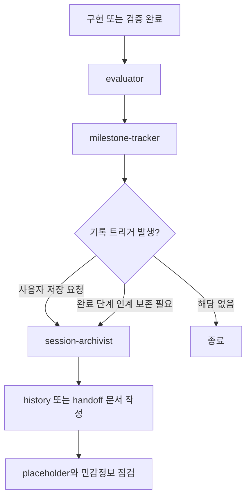

# 작업 히스토리 에이전트 설계 인계

## 세션 메타데이터

| 항목 | 값 |
|---|---|
| 작성일 | 2026-07-07 KST |
| 프로젝트 | `oms-codex` |
| Git 상태 | 초기 작성 당시 `.git` 디렉터리 없음 |
| 목적 | 세션 로그와 다음 세션 인계 전담 agent 구현 상태를 이어받기 위한 설계 인계 |

## 현재 상태 요약

현재 하네스에는 세션 로그와 다음 세션 인계 문서 작성을 전담하는 `session-archivist` custom agent가 추가되어 있다. 작업 진행 상태는 `milestone-tracker`, 계획 정합성은 `plan-auditor`, 반복 실패 학습은 `compound-learner`가 각각 담당한다. `session-archivist`는 세션 간 복구에 필요한 "이번 세션에서 무엇을 했고, 무엇을 검증했고, 다음 세션은 어디서 시작해야 하는가"를 일관된 형식으로 남기는 기록 담당이다.

이 agent는 상태를 판단하거나 계획을 감사하지 않는다. 세션 말미나 마일스톤 단계 완료 시 append-only 성격의 세션 로그와 인계 문서를 작성하는 기록 담당으로 제한한다.

## 코드베이스 이해

### 주요 구조

| 경로 | 역할 | 이번 설계와의 관련성 |
|---|---|---|
| `.codex/agents/` | custom agent TOML 정의 | `session-archivist.toml` 추가됨 |
| `.agents/skills/` | agent가 사용하는 skill 정의 | `session-archive/SKILL.md` 추가됨 |
| `.agents/skills/orchestrate/SKILL.md` | 마일스톤 파이프라인 조율 | 사용자 보존 요청 또는 완료 단계 인계 보존 시 호출 규칙 추가됨. 직접 재개 프롬프트 요청은 기존처럼 텍스트만 출력 |
| `.agents/skills/milestone-track/SKILL.md` | 마일스톤 상태 갱신 | 진행률 판단과 `docs/progress/**` 마일스톤 원장 기록은 유지하고, `session-archivist`는 이를 읽어 세션 로그/인계를 작성 |
| `.agents/skills/plan-audit/SKILL.md` | 계획 정합성 감사 | 문서 drift 판단은 유지하고, 일반 세션 기록은 제외 |
| `.agents/skills/compound/SKILL.md` | 반복 실패 학습 정리 | 학습 가능한 패턴 추출은 유지하고, 일반 세션 로그는 제외 |
| `docs/handoffs/` | 다음 세션 인계 문서 | agent 설계 인계 문서 저장 위치 |
| `scripts/verify.ps1` | Windows 검증 스크립트 | agent 11개, skill 12개 기준 반영됨 |
| `scripts/verify.sh` | Bash 검증 스크립트 | agent 11개, skill 12개 기준 반영됨 |

### 현재 agent 목록

현재 `.codex/agents`에는 11개 agent가 있다.

- `bug-fixer`
- `compound-learner`
- `design-reviewer`
- `evaluator`
- `milestone-tracker`
- `plan-auditor`
- `qa-guard`
- `refactor-specialist`
- `security-auditor`
- `session-archivist`
- `tdd-agent`

## 결정 사항

| 결정 | 선택지 | 근거 |
|---|---|---|
| 작업 히스토리 전담 agent | 추가할 가치 있음 | 세션 복구와 작업 추적은 반복적으로 필요하며 기존 agent의 핵심 책임과 다르다 |
| 권장 이름 | `session-archivist` | 히스토리 전반보다 세션 단위 기록과 인계에 초점을 둔다 |
| 역할 범위 | append-only 기록 담당 | 진행률 판단, 품질 평가, 계획 감사까지 맡기면 책임이 비대해진다 |
| 자동 실행 범위 | 조건부 실행 | 매 세부 변경마다 실행하면 노이즈와 문서 churn이 커진다 |
| 문서 저장 위치 | `docs/history/`와 `docs/handoffs/` | 세션 로그와 다음 세션 인계를 분리한다. `docs/progress/**`는 `milestone-tracker` 소유로 유지한다 |

## 목표 역할 분리

| Agent | 목적 | 실행 시점 | 산출물 |
|---|---|---|---|
| `session-archivist` | 세션 로그와 다음 세션 인계 작성 | 사용자 보존 요청, 마일스톤 완료 단계에서 인계 보존이 필요할 때 | `docs/history/YYYY/MM/DD/NN-*.md`, `docs/handoffs/NN-*.md` |
| `milestone-tracker` | 마일스톤 체크리스트 진행 상태와 마일스톤 원장 기록 갱신 | 마일스톤 작업 시작·완료·재개 시 | `docs/progress/milestone-status.md`, `docs/progress/milestones/M{N}.md` |
| `plan-auditor` | 계획·체크리스트·근거 문서 간 drift 감사 | 계획 변경, 장기 작업 재개, 사용자가 감사 요청 시 | audit 보고서 |
| `compound-learner` | 반복 실패에서 재사용 가능한 학습 추출 | QA/evaluator/design-review 반복 실패 후 | compound 정리 문서 |

## 호출 흐름 설계



### 조건부 호출 의사코드

```text
if user says "히스토리 저장" or "다음 세션에서 불러오게" or "인계 문서":
    run session-archivist
else if milestone completion phase needs persisted handoff:
    run session-archivist
else if user directly requests resume prompt:
    skip session-archivist
    orchestrate outputs prompt text only without creating files
else:
    skip session-archivist
```

## 책임 경계 상세

### `session-archivist`가 담당할 항목

- 세션 목적과 실제로 완료한 작업 요약
- 변경 또는 생성한 파일 목록
- 중요한 결정과 결정 근거
- 실행한 검증 명령과 결과
- 실행하지 못한 검증과 이유
- 다음 세션의 첫 실행 항목
- 미해결 질문과 보류 범위
- 민감정보가 문서에 포함되지 않았는지 확인
- `docs/progress/**`를 읽어 현재 상태를 요약하되 직접 수정하지 않음

### `session-archivist`가 담당하지 않을 항목

- 마일스톤 완료 여부 판정
- `docs/progress/milestone-status.md`, `docs/progress/milestones/M{N}.md` 직접 수정
- 재개 프롬프트 자체 생성
- 계획과 실제 구현의 정합성 감사
- 코드 품질, 보안, 디자인 품질 검수
- 반복 실패의 원인 학습과 규칙화
- 사용자의 명시 요청 없는 대규모 문서 재작성
- Git commit, push, PR 생성

## 문서 산출물 설계

### 세션 로그

세션 로그는 세션의 사실 기록이다. 마일스톤 원장 기록이 아니며, `docs/progress/**`의 상태를 읽어 세션 단위로 재구성한 기록이다. 다음과 같은 경로를 기본값으로 둔다.

```text
docs/history/YYYY/MM/DD/NN-kebab-case-session-log.md
```

권장 섹션은 다음과 같다.

```text
# 세션 로그

## 메타데이터
## 작업 목적
## 수행한 작업
## 변경 파일
## 검증 결과
## 결정 사항
## 보류 항목
## 다음 액션
```

### 다음 세션 인계

다음 세션 인계는 복구 지향 문서다. 다음과 같은 경로를 기본값으로 둔다.

```text
docs/handoffs/NN-kebab-case-handoff.md
```

권장 섹션은 다음과 같다.

```text
# 세션 인계

## 현재 상태 요약
## 코드베이스 이해
## 완료된 작업
## 즉시 실행할 다음 단계
## 미해결 질문
## 주의사항
```

## 1차 구현 반영 내용

1. `.codex/agents/session-archivist.toml` 추가 완료
   - `name = "session-archivist"`
   - `model = "gpt-5.5"`
   - `model_reasoning_effort = "medium"`
   - 역할: 세션 로그와 다음 세션 인계 문서 작성

2. `.agents/skills/session-archive/SKILL.md` 추가 완료
   - 세션 로그와 인계 문서의 섹션 정의
   - 사용자 요청형, 완료 단계 인계 보존형 모드 구분
   - 민감정보와 placeholder 점검 규칙 정의
   - 기록 대상과 제외 대상을 명시
   - `docs/progress/**` 읽기 전용 원칙 명시

3. `.agents/skills/orchestrate/SKILL.md` 갱신 완료
   - 마일스톤 완료 단계에서 인계 보존이 필요할 때 `session-archivist` 조건부 호출 추가
   - 직접 재개 프롬프트 요청은 기존 `orchestrate` 경로를 유지한다. 이 경로는 파일을 생성하지 않고 텍스트만 출력한다
   - 사용자가 "히스토리 저장", "인계 문서", "다음 세션에서 불러오게"라고 요청한 경우 연결
   - 데이터 전달 경로 표에 `docs/history/**/*.md`와 `docs/handoffs/**/*.md`의 생산자를 `session-archivist`로 추가

4. 검증 스크립트 갱신 완료
   - `scripts/verify.ps1`: expected agent 목록에 `security-auditor.toml`, `session-archivist.toml` 추가, agent count 11 기준
   - `scripts/verify.sh`: expected agent 목록에 `security-auditor.toml`, `session-archivist.toml` 추가, agent count 11 기준
   - skill count는 12 기준

## 보류 범위

1차 구현에서는 자동 요약 데이터베이스, 검색 인덱스, 외부 memory 연동, Git commit 자동 생성은 만들지 않는다. 이 기능들은 작업 히스토리 agent의 유용성을 높일 수 있지만, 초기 책임을 흐리게 만들고 운영 복잡도를 늘린다.

세션 로그의 품질이 안정화된 뒤 필요하면 별도 단계에서 검색 가능한 인덱스나 memory 연동을 검토한다.

## 검증 계획

```text
1. 신규 TOML/skill 파일 추가 -> verify: TOML 필수 필드, model/effort 정책 확인
2. session-archive skill 작성 -> verify: 기록 대상/제외 대상, `docs/progress/**` 읽기 전용 원칙, 문서 형식이 명확한지 확인
3. orchestrate 호출 규칙 추가 -> verify: 사용자 보존 요청, 완료 단계 인계 보존 조건, 직접 재개 프롬프트 텍스트 출력 경계 확인
4. verify 스크립트 갱신 -> verify: PowerShell parser, bash -n, JSON 파서, scripts/verify.ps1 실행
```

## 다음 세션 즉시 실행 항목

1. 이 문서를 먼저 읽는다.
2. `_workspace/plan_audit_agent-boundaries.md` 최신 revision과 실제 지침이 일치하는지 확인한다.
3. 변경 후 `scripts/verify.ps1`과 가능한 경우 `bash -n scripts/verify.sh`를 실행한다.

## 미해결 질문

- 마일스톤 단계 완료마다 자동 기록하지 않고, 사용자가 요청했거나 완료 단계에서 인계 보존이 필요할 때만 조건부 호출하도록 반영했다.
- 세션 로그와 인계 문서는 요청 맥락에 따라 하나만 만드는 기본값으로 반영했다.
- 직접 재개 프롬프트 요청에서는 handoff 파일을 만들지 않고 `orchestrate`가 텍스트만 출력하는 기본값으로 반영했다. 파일 보존까지 원하면 별도 보존 요청으로 처리한다.

## 주의사항

- 이 저장소의 custom agent 모델은 `gpt-5.5`를 사용해야 한다.
- custom agent effort 값은 `medium` 또는 `high`만 사용한다.
- `session-archivist`는 기록 담당이므로 `medium`이 적절하다.
- 변경 시 `scripts/verify.ps1`과 `scripts/verify.sh`의 고정 agent/skill 개수를 함께 수정해야 한다.
- 문서는 `docs/` 아래에 저장한다.
- 설계 문서는 Git에 업로드하지 말라는 지침이 있으므로, Git 저장소 환경에서는 커밋/푸시 대상 여부를 사용자에게 확인한다.
